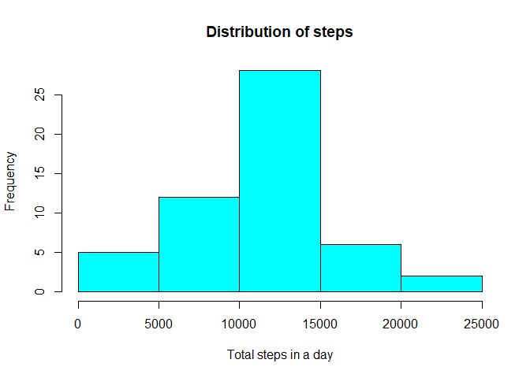
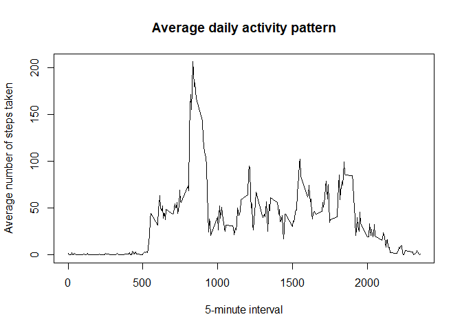
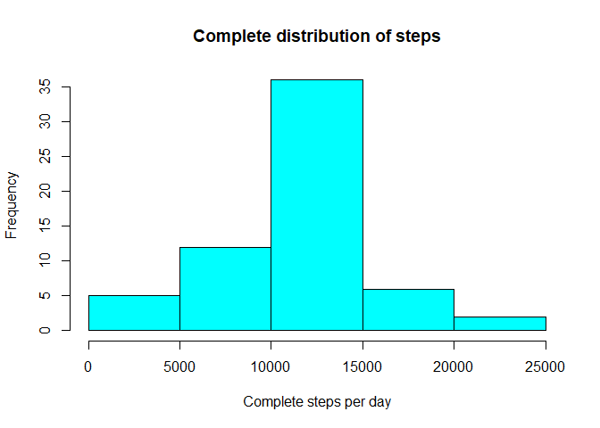
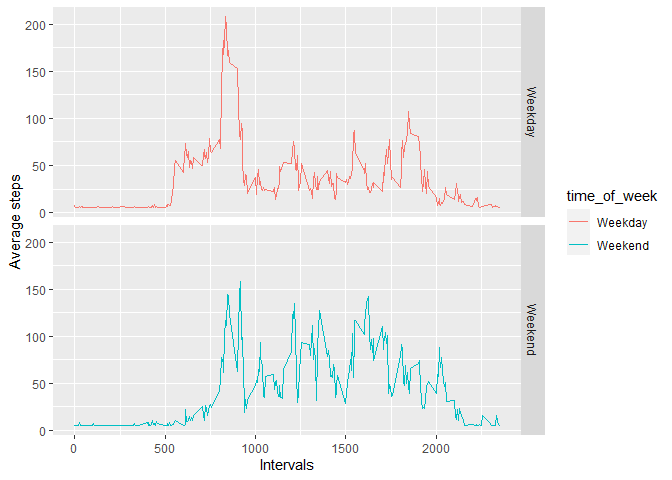

## Code for reading the file and formatting  
Reading the dataset

```r
getwd()
```

```
## [1] "D:/EDA/New folder/RR"
```

```r
activity_data <- read.csv("activity.csv", sep = ",", header = TRUE)
```
Since the datatype of the date column in the dataset is character, we will 
convert it to DATE type

```r
activity_data$date <- as.Date(as.character(activity_data$date))
class(activity_data$date)
```

```
## [1] "Date"
```

## The histogram for the total number of steps per day is as follows
First we will use the tapply function to get the total number of steps
each day  

```r
total_steps <- tapply(activity_data$steps, activity_data$date, FUN = sum)
hist(total_steps, col = "cyan", xlab = "Total steps in a day",main = "Distribution of steps")
```

<!-- -->

### The mean and median for steps taken per day is as follows  

```r
mean(total_steps, na.rm = TRUE)
```

```
## [1] 10766.19
```

```r
median(total_steps, na.rm = TRUE)
```

```
## [1] 10765
```

Converting the interval column to time format to calculate the 5 minute 
intervals  

```r
average_steps <- aggregate(activity_data$steps, by = list(activity_data$interval), FUN = mean, na.rm = TRUE)
plot(x = average_steps$Group.1,y = average_steps$x, type = "l",
     xlab = "5-minute interval", ylab = "Average number of steps taken",
     main = "Average daily activity pattern")
```

<!-- -->
Maximum number of steps on average in the 5 minute interval  

```r
intervals <- which.max(average_steps$x)
max_steps <- average_steps[intervals, 1]
print(max_steps)
```

```
## [1] 835
```

## Calculating the total number of missing values  

```r
total_NA <- sum(is.na(activity_data$steps))
print(total_NA)
```

```
## [1] 2304
```
## Strategy for filling the missing values  
We can use the mean to eliminate and missing values 
To implement the above statement we will use the impute function from the Hmisc package 

```r
library(Hmisc)
final_data <- activity_data
final_data$steps <- impute(activity_data$steps, mean)
```
# Histogram for the Complete data  

```r
final_steps_per_day <- tapply(final_data$steps, final_data$date, FUN = sum)
hist(final_steps_per_day, col = "cyan", xlab = "Complete steps per day", main = "Complete distribution of steps")
```

<!-- -->

## Mean and median for the above is as follows

```r
mean(final_steps_per_day)
```

```
## [1] 10766.19
```

```r
median(final_steps_per_day)
```

```
## [1] 10766.19
```

As compared to the first figure the mean value remains unchanged but the median now has increased from the first example and is equal to the mean value.   
Also the Frequency of the steps per day has also increased from the first example as we can notice that on the y-axis

# Difference in pattern for weekdays and weekends  
## We will sort the dates in terms of days

```r
library(lubridate)
```

```
## 
## Attaching package: 'lubridate'
```

```
## The following objects are masked from 'package:base':
## 
##     date, intersect, setdiff, union
```

```r
final_data$day <- weekdays(final_data$date) 
final_data$time_of_week <- ifelse(final_data$day == "Saturday" | final_data$day == "Sunday", "Weekend", "Weekday")
library(ggplot2)
week_data <- aggregate(final_data$steps, by = list(final_data$time_of_week, final_data$interval), FUN = mean)
names(week_data) <- c("time_of_week","interval", "steps" )
ggplot(data = week_data, aes(interval, steps, col = time_of_week)) + facet_grid(time_of_week ~.) +
  xlab("Intervals") + ylab("Average steps") + geom_line()
```

<!-- -->


